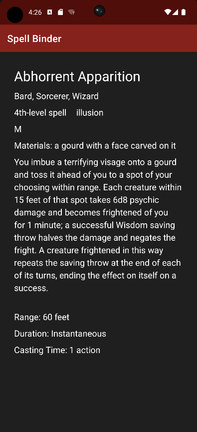

# Spell Binder

Spell Binder is an Android application used as a quick resource for looking up D&D 5e Core SRD spells. It does not currently support homebrew, and requires an internet connection, as it accesses data from the Open5E API.

Spells received from Open5E are sorted in alphabetical order, and separated into 7 pages that can be navigated by the use of two buttons at the top of the recycler view. One can view additional information about a spell, such as classes that can use it, description, or components, by tapping on a spell's name in the recycler view, and the fragment will inflate. Upon exiting the inflated view, the user will still be on the same page they were on before viewing the spell's details.

When tapping the navigation buttons at the top of the recycler view, the app will also provide auditory feedback by playing a sound akin to turning a page.

